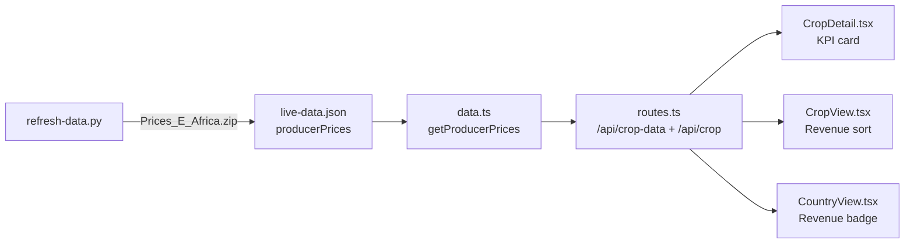

# FAOSTAT Producer Prices Integration — Design Spec

## Goal

Wire FAOSTAT Producer Prices (USD/tonne) into Afrixplorer to compute **estimated gross revenue per hectare** on the crop detail page (`/explore/{country}/{crop}`), and add a **Revenue/Ha sort** on the crops comparison page (`/crop/{crop}`).

This turns Afrixplorer from a data explorer into an investment screener.

## Data Source

**FAOSTAT Prices domain — bulk download:**
- URL: `https://bulks-faostat.fao.org/production/Prices_E_Africa.zip` (~1.4 MB)
- CSV: `Prices_E_Africa_NOFLAG.csv` (19,678 rows)
- Filter: Element Code `5532` (Producer Price, USD/tonne), Months Code `7021` (Annual value only)
- Year columns: `Y1991` through `Y2025`

### CSV Column Structure (verified)

```
Area Code, Area Code (M49), Area, Item Code, Item Code (CPC), Item,
Element Code, Element, Months Code, Months, Unit, Y1991...Y2025
```

> [!IMPORTANT]
> The CSV includes monthly data (Months Code `7001`–`7012`). We **must** filter to `Months Code == "7021"` (Annual value) to avoid duplicating rows.

## Proposed Changes

### Data Pipeline (`scripts/refresh-data.py`)

#### [MODIFY] [refresh-data.py](file:///Users/bg/Developer/Afrixplorer/scripts/refresh-data.py)

Add a new function `fetch_faostat_prices()` following the same pattern as `fetch_faostat_data()`:

1. Download `Prices_E_Africa.zip`
2. Open `Prices_E_Africa_NOFLAG.csv`
3. Filter rows where:
   - `Element Code == "5532"` (USD/tonne)
   - `Months Code == "7021"` (Annual value)
   - `Area Code (M49)` maps to a known African country via `M49_TO_ISO3`
4. Reuse existing `clean_crop_name()` to normalize item names
5. Store as: `{ country_display_name: { crop_clean_name: { year: price_usd } } }`

In `main()`, call the new function and write the result to `output["producerPrices"]`.

---

### Data Layer (`server/data.ts`)

#### [MODIFY] [data.ts](file:///Users/bg/Developer/Afrixplorer/server/data.ts)

Add a new getter:
```ts
export function getProducerPrices(): Record<string, Record<string, Record<string, number>>> {
  const live = loadLiveData();
  if (live?.producerPrices) return live.producerPrices;
  return {};  // No fallback — gracefully hidden when missing
}
```

---

### API Routes (`server/routes.ts`)

#### [MODIFY] [routes.ts](file:///Users/bg/Developer/Afrixplorer/server/routes.ts)

**Modify `/api/crop-data/:country/:crop`** — add `producerPrices` to the response:
```ts
const prices = getProducerPrices();
const cropPrices = prices[country]?.[crop];
```
Return `producerPrices: cropPrices || null` alongside existing `timeSeries` and `globalAvgYield`.

**Modify `/api/crop/:crop`** — add `revenuePerHa` to each country entry:
```ts
// For each country: compute revenue = (latestYield / 10000) × avgPrice(3yr)
```
This enables the Revenue/Ha sort on the frontend without additional API calls.

---

### Frontend — Crop Detail Page

#### [MODIFY] [CropDetail.tsx](file:///Users/bg/Developer/Afrixplorer/client/src/pages/CropDetail.tsx)

Add a 5th KPI card when producer price data is available:

```
Est. Gross Revenue
~$2,400/ha
yield × FAOSTAT producer price (3yr avg, USD)
```

**Revenue computation:**
```js
const yieldTonnesPerHa = latestYield / 10000;  // hg/ha → t/ha
const recentPrices = Object.entries(producerPrices)
  .filter(([yr]) => Number(yr) >= latestYear - 2)
  .map(([, p]) => p);
const avgPrice = recentPrices.reduce((a, b) => a + b, 0) / recentPrices.length;
const revenuePerHa = yieldTonnesPerHa * avgPrice;
```

**Missing data handling:** If no price data → hide the card entirely. No "—" placeholder.

---

### Frontend — Crop Comparison Page

#### [MODIFY] [CropView.tsx](file:///Users/bg/Developer/Afrixplorer/client/src/pages/CropView.tsx)

Add `Revenue/Ha` to the `SortField` type and `SortHeader` bar:
```
Sort by: Production | Yield | Area | Yield Gap | Exports | Growth | Revenue/Ha
```

Use the pre-computed `revenuePerHa` from the `/api/crop/:crop` response.

---

### Frontend — Country Page

#### [MODIFY] [CountryView.tsx](file:///Users/bg/Developer/Afrixplorer/client/src/pages/CountryView.tsx)

On each crop card, add a small revenue badge when available:
```
Est. ~$2,400/ha gross
```

## Data Flow



## Verification Plan

### Automated
1. Run `python3 scripts/refresh-data.py` — confirm `producerPrices` key appears in `live-data.json`
2. Spot-check: `curl localhost:4040/api/crop-data/Nigeria/Maize` — confirm `producerPrices` field
3. Verify build: `npm run build` passes

### Manual
1. Navigate to `/explore/Nigeria/Maize` — verify revenue KPI card appears
2. Navigate to a crop/country with no price data — verify card is hidden (no errors)
3. Navigate to `/crop/Maize` — verify Revenue/Ha sort works
4. Navigate to `/country/Nigeria` — verify revenue badges on crop cards

## Out of Scope
- Per-item FAOSTAT API calls (Option B)
- Price trend charts over time
- Input cost estimation (this is gross revenue only)
