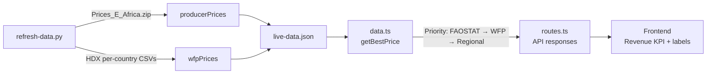

# WFP Food Prices Fallback — Design Spec

## Problem

FAOSTAT producer prices are the primary price source for revenue-per-hectare calculations, but coverage is severely uneven. Nigeria (the largest agricultural economy in Africa) has data stuck at 2013 for most crops. Any user looking at Nigerian Yams at $318/t (2013) is seeing a number that's 10+ years stale — a dealbreaker for investment credibility.

## Solution

Add **WFP food prices from HDX** as a secondary price source. During the data pipeline build, download per-country CSVs, parse them into `[country][crop][year] → avg USD/tonne`, apply a farmgate discount (~50%), and use this when FAOSTAT prices are >5 years stale.

## Data Source

**WFP VAM Food Prices via HDX (Humanitarian Data Exchange)**

- URL pattern: `https://data.humdata.org/dataset/wfp-food-prices-for-{country-slug}`
- API: HDX CKAN API (free, no auth): `https://data.humdata.org/api/3/action/package_show?id=wfp-food-prices-for-{country-slug}`
- Format: CSV, CC-BY-4.0 license
- Coverage: Monthly prices, January 2002 – March 2026, 54 African countries
- Updated: Every ~2 weeks

### CSV Schema (verified from Nigeria dataset)

```
date,admin1,admin2,market,market_id,latitude,longitude,category,commodity,commodity_id,unit,priceflag,pricetype,currency,price,usdprice
```

Key columns:
- `commodity`: e.g. "Maize", "Yam", "Sorghum", "Rice (local)"
- `unit`: variable — "KG", "2.5 KG", "2.7 KG", "L", "400 G"
- `pricetype`: "Retail" or "Wholesale"
- `usdprice`: price in USD for the stated unit (already converted from local currency)
- `date`: "YYYY-MM-DD" format

### Unit Normalization

Prices must be normalized to **USD per KG**, then scaled to **USD per tonne** (×1000):

| Unit format | Normalization |
|-------------|---------------|
| `KG` | `usdprice / 1.0` |
| `2.5 KG` | `usdprice / 2.5` |
| `400 G` | `usdprice / 0.4` |
| `L` | Skip (liquid — not relevant for our dry crops) |
| `pcs`, `30 pcs` | Skip (not weight-based) |

### Commodity Name Mapping

WFP commodity names differ from FAOSTAT names and vary by country. The pipeline must map them:

| WFP Name(s) | Our Crop Name | Notes |
|-------------|--------------|-------|
| Maize, Maize (white), Maize (yellow) | Maize | |
| Maize flour | Maize | `isProcessedProxy: true` — flour proxy, ~15-25% milling premium cancels with farmgate discount |
| Millet | Millet | |
| Sorghum, Sorghum (white), Sorghum (brown) | Sorghum | |
| Rice (local), Rice (milled, local) | Rice | |
| Rice (imported) | *skip* | Not domestic production |
| Yam, Yam (Abuja) | Yams | |
| Cassava | Cassava | Only if raw cassava appears |
| Cassava meal (gari, white), Gari (white) | *skip* | Processed (~3× raw price) — fall through to regional FAOSTAT proxy |
| Beans (niebe), Beans (white), Beans (red) | Beans | |
| Cowpeas, Cowpeas (brown), Cowpeas (white) | Cowpeas | |
| Groundnuts, Groundnuts (shelled) | Groundnuts | |
| Onions | Onions | |
| Tomatoes | Tomatoes | |
| Bananas | Bananas | |
| Oranges | Oranges | |
| Wheat | Wheat | |
| Oil (palm) | *skip* | Liquid unit |
| Sugar | Sugar Cane | |

> [!IMPORTANT]
> This mapping must be a dict in the script, not hardcoded logic, so we can extend it per country as new WFP commodities appear. Entries mapping to `None` are explicitly skipped (processed products too far from raw commodity price).

### Farmgate Discount

WFP prices are **retail/wholesale market prices**, not farmgate. Farmgate prices are typically **45–55% of retail** due to transport, middlemen, and market fees. We apply a **0.50 multiplier** (50% of retail) to estimate farmgate, and label the result accordingly.

> [!NOTE]
> The 50% factor is a well-documented approximation. For high-value cash crops (coffee, cocoa), the discount is larger (~40%). For staple cereals, it's smaller (~55-60%). Using 50% across the board is a reasonable default.

### Processed Proxy Flag

When a WFP commodity is a processed form of our target crop (e.g. "Maize flour" → "Maize"), the returned price carries an `isProcessedProxy: true` flag. The frontend labels these as `"WFP 2026 (est. farmgate, flour proxy)"` for transparency. The milling premium (~15-25%) partially cancels with the farmgate discount, making the estimate usable.

### Price Flag Filter

The WFP CSV includes a `priceflag` column with values `"actual"`, `"aggregate"`, and `"estimated"`. We **only use `"actual"` observations** — WFP's own interpolated/estimated values are excluded to avoid stacking two layers of estimation.

### Country Key Format

WFP prices are keyed by **display name** (e.g. `"Nigeria"`, `"Kenya"`) — the same format used by `producerPrices` in `live-data.json`. This ensures `getBestPrice()` can look up both sources with the same key.

---

## Proposed Changes

### Data Pipeline

#### [MODIFY] [refresh-data.py](file:///Users/bg/Developer/agri-explorer/scripts/refresh-data.py)

Add `fetch_wfp_prices()` function:

1. For each African country in our dataset, query the HDX CKAN API to discover the CSV download URL
2. Download the CSV (typical size: 1-5 MB per country)
3. Parse rows, filtering to:
   - `priceflag == "actual"` only (no WFP estimates or aggregates)
   - `pricetype == "Wholesale"` preferred, fall back to `"Retail"` if no wholesale
   - Most recent **full year** (2025 or latest available)
   - Only commodities that map to our crop names (skip `None`-mapped entries like gari)
4. For each country/crop, compute the **annual average USD/tonne** from all markets:
   - Parse `unit` field → extract KG weight → `usdprice / kg_weight` → `× 1000` = USD/tonne
   - Average across all markets and months in the year
5. Apply the **0.50 farmgate discount multiplier**
6. Track `isProcessedProxy: true` for flour/processed → grain mappings
6. Store as: `{ country: { crop: { year: price_usd_farmgate } } }`

In `main()`, call after `fetch_faostat_prices()`. Merge the results: for any country/crop where FAOSTAT is >5 years stale, substitute with the WFP-derived price.

Add `wfpPrices` as a separate key in `live-data.json` (keep FAOSTAT prices untouched). Merge happens at query time in `getBestPrice()`.

#### HDX Country Slug Discovery

Use the CKAN API to search for WFP food price datasets:
```
GET https://data.humdata.org/api/3/action/package_show?id=wfp-food-prices-for-{country_slug}
```

Country slug mapping (ISO3 → HDX slug):
```python
ISO3_TO_HDX_SLUG = {
    "NGA": "nigeria", "KEN": "kenya", "GHA": "ghana", "UGA": "uganda",
    "TZA": "united-republic-of-tanzania", "ETH": "ethiopia", "CMR": "cameroon",  # TZA slug verified ✅
    "MOZ": "mozambique", "MWI": "malawi", "ZMB": "zambia", "RWA": "rwanda",
    "SEN": "senegal", "MLI": "mali", "BFA": "burkina-faso", "NER": "niger",
    "TCD": "chad", "BEN": "benin", "TGO": "togo", "CIV": "cote-d-ivoire",
    "SLE": "sierra-leone", "LBR": "liberia", "GIN": "guinea", "MDG": "madagascar",
    "ZWE": "zimbabwe", "NAM": "namibia", "BWA": "botswana", "LSO": "lesotho",
    "SWZ": "eswatini", "ZAF": "south-africa", "SDN": "sudan", "SSD": "south-sudan",
    "SOM": "somalia", "DJI": "djibouti", "ERI": "eritrea",
    "COD": "democratic-republic-of-the-congo",  # NOT "the-" prefix — verified ✅
    "COG": "congo", "CAF": "central-african-republic", "GAB": "gabon",
    "BDI": "burundi", "AGO": "angola", "MRT": "mauritania",
    "EGY": "egypt", "MAR": "morocco", "TUN": "tunisia", "DZA": "algeria",
    "LBY": "libya", "GMB": "gambia", "GNB": "guinea-bissau", "MUS": "mauritius",
}
```

Not every country has a WFP dataset. The pipeline should gracefully skip missing datasets (log a warning, move on).

---

### Server Data Layer

#### [MODIFY] [data.ts](file:///Users/bg/Developer/agri-explorer/server/data.ts)

Add `getWfpPrices()` getter and update `BestPrice` interface:
```ts
export interface BestPrice {
  price: number;
  year: string;
  source: string;
  isEstimate: boolean;
  isProcessedProxy: boolean;  // true when e.g. Maize flour → Maize grain
}

export function getWfpPrices(): Record<string, Record<string, Record<string, number>>> {
  const live = loadLiveData();
  if (live?.wfpPrices) return live.wfpPrices;
  return {};
}
```

Update `getBestPrice()` to use WFP prices as a fallback tier:

**Current priority:**
1. FAOSTAT recent data (< 5 years old) → use as-is
2. Regional peer average → estimate
3. Stale FAOSTAT data → last resort

**New priority:**
1. FAOSTAT recent data (< 5 years old) → use as-is
2. **WFP farmgate-adjusted price** → labeled "WFP 2025 (est. farmgate)" or "WFP 2025 (est. farmgate, flour proxy)"
3. Regional peer average → estimate
4. Stale FAOSTAT data → last resort

---

### Frontend — Price Source Labeling

#### No frontend file changes needed

The existing `bestPrice.source` string and `bestPrice.isEstimate` boolean already propagate to the UI. The `getBestPrice()` changes will automatically surface labels like:
- `"WFP 2025 (est. farmgate)"` — for WFP-derived prices
- `"WFP 2026 (est. farmgate, flour proxy)"` — for processed proxy prices
- `"FAOSTAT 2024"` — for fresh FAOSTAT data
- `"West Africa avg"` — for regional proxy

---

## Data Flow



---

## Verification Plan

### Automated

1. **Pipeline test**: Run `python3 scripts/refresh-data.py` → confirm `wfpPrices` key in `live-data.json` with entries for Nigeria/Maize, Nigeria/Yams, etc.
2. **Spot-check prices**: `python3 -c "import json; d=json.load(open('server/data/live-data.json')); print(d['wfpPrices']['Nigeria'])"` — confirm prices are in the 100-1000 USD/t range (farmgate-adjusted)
3. **API verification**: `curl localhost:3001/api/crop-data/Nigeria/Yams` — confirm `bestPrice.source` shows WFP-derived label instead of "FAOSTAT 2013"
4. **Build check**: `npm run build` passes

### Manual

1. Navigate to `/explore/Nigeria/Yams` — verify the revenue KPI card shows a 2025-era price, not $318/t from 2013
2. Navigate to `/explore/Kenya/Maize` — verify it still shows the FAOSTAT 2024 price (Kenya has fresh data, WFP should not override)
3. Check that price source labels are clear and transparent (users should know when they're seeing an estimate)

## Out of Scope

- Live API calls to WFP/HDX at request time (all data is bulk-downloaded during pipeline refresh)
- Per-crop farmgate discount tuning (using flat 50% for v1)
- WFP price trend charts (just using latest year for revenue calculation)
- Non-African countries
